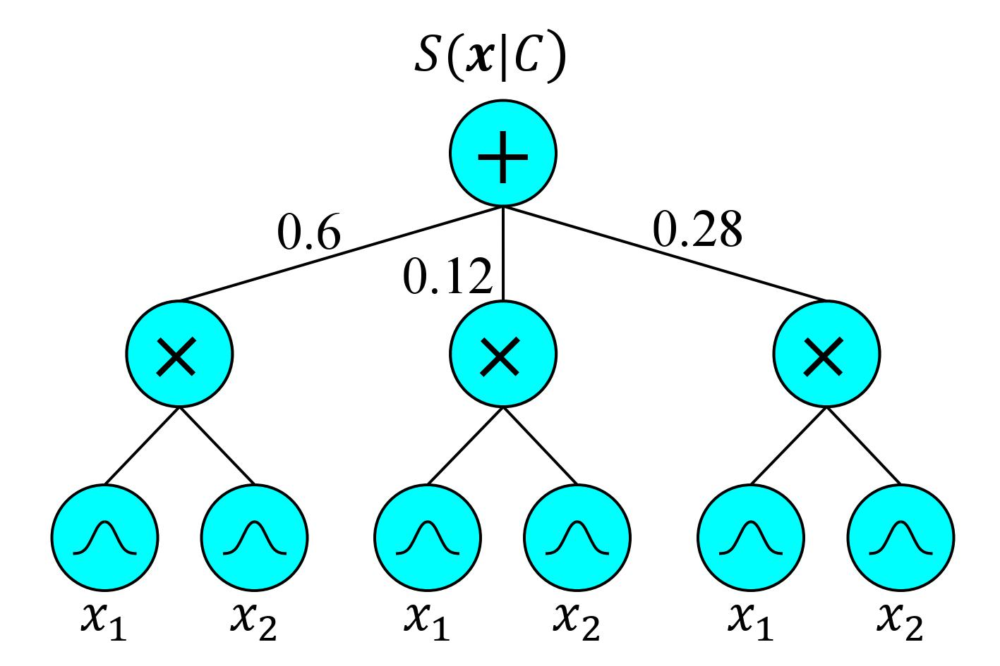

<!--- 

export PATH=/usr/local/cuda-10.0/bin${PATH:+:${PATH}}
export LD_LIBRARY_PATH=/usr/local/cuda-10.0/lib64${LD_LIBRARY_PATH:+:${LD_LIBRARY_PATH}}

-->
Sum-Product Networks for Robust Automatic Speaker Recognition
====
Please note that this repository is currently in its early stages
-----

Sum-product networks are used here for robust speaker recognition. The marginalisation missing feature approach is used as the model-compensation technique to improve the robustness. 

SPFlow is modified to accomadate the implementation.


||
|----|
| <p align="center"> <b>Figure 1:</b> <a> SPN speaker model.</a> </p> |


Installation
-----

Optional, only required if using a GPU:

* [CUDA 10.0](https://developer.nvidia.com/cuda-10.0-download-archive)
* [cuDNN (>= 7.4.1)](https://developer.nvidia.com/cudnn)

To install:

1. `git clone https://github.com/anicolson/SPN-Spk-Rec.git`
2. `cd SPN-Spk-Rec`
3. `virtualenv --system-site-packages -p python3 ~/venv/SPN-Spk-Rec`
4. `source ~/venv/SPN-Spk-Rec/bin/activate`
5. `pip install --upgrade tensorflow`
6. `pip install -r requirements.txt`

If a GPU is to be used, replace step 4 with: `pip install --upgrade tensorflow-gpu`

TIMIT corpus
-----
Place the TIMIT corpus in the data path. E.g. the train directory for TIMIT should be located at data/timit/train. Similarly, the test directory for TIMIT should be located at data/timit/test.

Noisy speech
-----
The noisy speech created from the clean speech files from the TIMIT corpus, and the noise of your choosing should be placed in data/noisy_speech. 

Each filename in data/noisy_speech should coprise of the following: *w_x_y_zdB.wav*, where **w** is the speaker (e.g. *mmds0*), **x** is the utterance (e.g. *sa1*), **y** is the noise source (e.g. *f16*), and **z** is the SNR level in dB (e.g. *-5*). An example filename is as follows: *mjjj0_sa1_voice-babble_-5dB.wav*. 

How to use
-----
**Inference on clean speech:**

Note: the TIMIT corpus must be in the correct directory prior to running the following:

```
python3 main.py --ver '0a' --test_clean_speech 1 
```
Version *0a* is what is used in the paper.

**Inference on noisy speech:**

Note: the TIMIT corpus and the noisy speech must be in the correct directories prior to running the following:

```
python3 main.py --ver '0a' --test_noisy_speech 1 --mft 'bmarg'
```
Use *--mft 'bmarg'*, *--mft 'marg'*, or *--mft 'none'* to detirmine what type of marginalisation is used.


**Training:**

Note: the TIMIT corpus must be in the correct directory prior to running the following:

```
python3 main.py --ver 'new_models' --train 1 --verbose 1 --min_instances_slice 50 --threshold 0.3
```
